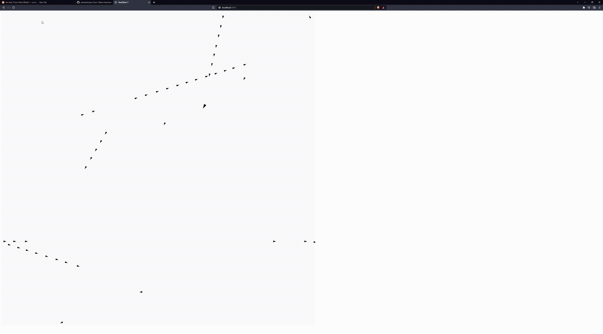

# Yew App / Chat / Game

## Summary

This is a quick app prototype which has Websocket chat and network game functions.

For the sake of simplicity, the game is a rough clone of the 80's PC "Spacewar".  Currently there is the ship and torpedo firing.  Next will be collisions, maybe a gravitational well.

Then will hook it up to the Actix server and make a multi-player version.

## How to run the game

The basic environment requirements are the same as for a general Yew app -- that's Rust and Trunk.   
https://github.com/yewstack/yew

From project root, run `trunk serve`.  
Go to localhost:9090

